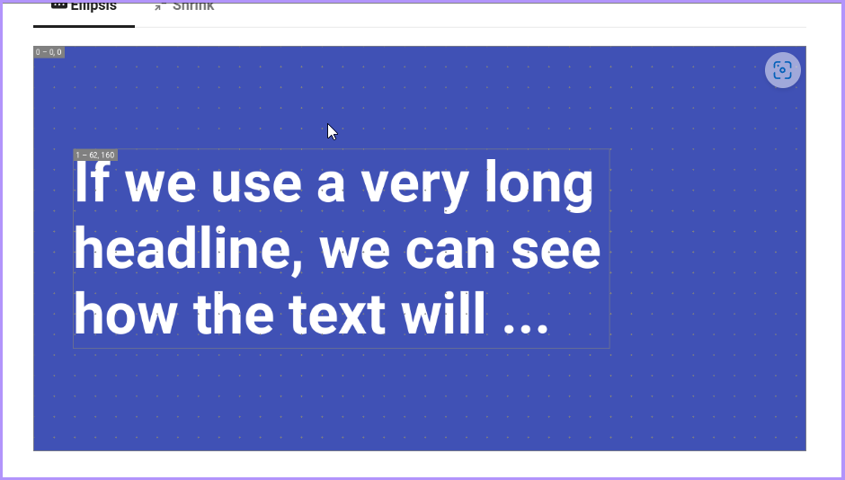

??? warning classes
     Opasno.

---

> 
> **⚠ WARNING: Aliens are coming.** 
> 

---
> **⚠ WARNING: Aliens are coming.**
> A description of the colour, smell and dangerous behaviour of the aliens.

---

| ⚠️ Warning                               | 
|------------------------------------------|
| You shouldn't. This is irreversible!     |

---

> <picture>
>   <source media="(prefers-color-scheme: light)" srcset="https://raw.githubusercontent.com/Mqxx/GitHub-Markdown/main/blockquotes/badge/light-theme/danger.svg">
>   
> </picture> 
>
> OpasnoOpasno

---

# Авторизация

## "Требования к браузеру"
    Для работы в системе необходимы последние версии Webkit браузеров (Google Chrome, Яндекс.Браузер, Opera или Safari). 

## Регистрация

При первом входе в систему необходима регистрация. Перейдите по ссылке-приглашению, предоставленной администратором.

Введите следующие данные для создания учетной записи:
- Имя (First Name)
- Фамилия (Last Name)
- Пароль и его подтверждение

"Требования к паролю"
    Пароль должен:
    - Состоять не менее чем из 8 символов
    - Включать буквы от A до Z и a до z
    - Содержать цифры от 0 до 9
    - Использовать специальные символы: !@#$%^&*()-+_=[]{}<>,./\?|`~:;

Завершите регистрацию нажатием на Sign In. После этого откроется профиль пользователя.

## Профиль пользователя

В профиле отображаются:
- Адрес электронной почты
- Имя и фамилия
- Информация о текущих и завершенных сессиях
- Список доступных рабочих пространств

### Account Info

В блоке Account Info можно изменить имя и фамилию. После редактирования нажмите на значок справа для сохранения.

### Рабочее пространство

В правой панели профиля отображается список доступных рабочих пространств. Выберите нужное рабочее пространство, чтобы войти.

### Выход из системы

???+ Выход из системы

    1. выйдите
    2. перезагрузите
    3. зайдите

## Вход в систему

Для входа введите адрес электронной почты и пароль в окне Sign In.

![Диалог входа в систему]

### Некорректные данные

При вводе неверных данных система выдает сообщение:
- *No user found for given credentials* — при ошибке логина и/или пароля
- *Error: Incorrect username or password* — при входе через AD

После превышения количества попыток (по умолчанию не более 5), аккаунт блокируется на 15 минут. Сообщение системы: *Too many failed sign in attempts. Please try again in 15 minutes*.

При забытом пароле воспользуйтесь опцией Forgot password? для его восстановления.

## Смена пароля

### Переустановка пароля по запросу

Для смены пароля нажмите Forgot password? в диалоге входа. Введите адрес электронной почты, зарегистрированный в системе. На него придет ссылка для сброса пароля.

![Диалог смены пароля]

### Смена пароля по истечении срока действия

Когда срок действия пароля истечет, откроется форма установки нового пароля.

![Диалог установки нового пароля]

1. Введите текущий пароль в поле Current password.
2. Введите и повторите новый пароль.

!!! warning "Обратите внимание"
    Новый пароль должен отличаться от старого. При совпадении система выдаст сообщение об ошибке. Возможно требование изменения хотя бы одного символа, но администратор может установить иные правила.

После успешной замены пароля система подтвердит его обновление.

![Сообщение об установке нового пароля]

Для входа используйте ссылку Sign in with new password.

## Что дальше?

После входа в систему вы можете создать новую модель. См. раздел [Создание модели][model-creation].

Если у вас есть доступ к уже созданной модели, ознакомьтесь с [Управление моделями][model-control].