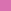
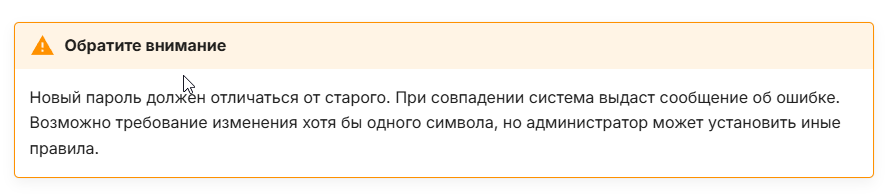

# Styleguide 

### Фирменный стиль

Шрифт| Цвет | Использование | 
------- | ------ | ------- | 
Inter (основной, используем во всех документах) |  Sunglow #FDCD56 | --- | 
Arial (доп. не используем) |  Sky magenta #D971B0 | при наведении на текст раздела/топика | 
Montserrat (доп. не используем) |  Amethyst #8068BC | текущий топик/раздел | 
PT Sans (доп. не используем) | Outer Space #474747 | заголовки | 

---
<br>

### дополнительная документация по фирменному стилю находится в папке

><span style="background-color:##474747">
> OM_HQ_MP 012-022-F OPTIMACROS BRANDBOOK С ОБЩИМ ДОСТУПОМ 
> </span>


<br>
<br>


# Оформление списков, предупреждений и т.д.

><span style="background-color:##474747">
> 1. Warning или обрати внимание:
> </span>

## Вариант 1

```
!!! warning "Обратите внимание"
    Новый пароль должен отличаться от старого. тексттексттекст.
```


**пример**


---

## Вариант 2

```
> <picture>
>   <source media="(prefers-color-scheme: light)" srcset="https://raw.githubusercontent.com/Mqxx/GitHub-Markdown/main/blockquotes/badge/light-theme/warning.svg">
>   
> </picture><br>
>
> Warning
```

**пример**


---
><span style="background-color:##474747">
> 2. Шаги или огромный список
> </span>

## Вариант 1

```
???+ text

    1. выйдите
    2. перезагрузите
    3. зайдите
```
**пример**


---


## Вариант 2

```
<details open>
<summary>Выход список</summary>
<br>
  
1. Выйдите
    - закройте программу
2. Перезагрузите
  - откройте программу
3. Зайдите


</details>
```
**пример**


---

<br>


[комбинации уведомлений](https://squidfunk.github.io/mkdocs-material/reference/admonitions/)

[доп. комбинации](https://github.com/Mqxx/GitHub-Markdown?tab=readme-ov-file##)

<br>
<br>

# Оформление таблиц и графиков

### Таблицы

```
| **Название** | **Описание**          | **Цена** | **Наличие**   |
|--------------|------------------------|---------:|:-------------:|
| Товар A      | Качественный товар     |  $10.00  |   В наличии   |
| Товар B      | Лучшее предложение     |  $20.00  |   На складе   |
| Товар C      | Эксклюзивный товар     |  $15.00  | Под заказ     |
| Товар D      | Популярный товар       |   $8.00  |   В наличии   |
```

**пример**

| **Название** | **Описание**          | **Цена** | **Наличие**   |
|--------------|------------------------|---------:|:-------------:|
| Товар A      | Качественный товар     |  $10.00  |   В наличии   |
| Товар B      | Лучшее предложение     |  $20.00  |   На складе   |
| Товар C      | Эксклюзивный товар     |  $15.00  | Под заказ     |
| Товар D      | Популярный товар       |   $8.00  |   В наличии   |

---


<br>

### Графики

Используем по максимум расширение [`Mermaid`](https://mermaid.js.org/intro/syntax-reference.html)

[ссылка](https://mermaid.live/edit#pako:eNpdkMEOgjAMhl-F9Gjg4nEHL3rlxE3noWEVFtlKxkZiCO_u3IIaevr79W_TdoGWFYGAyaOni8bOoanmo7RFjNvhXlTVqWi8HoaMkkwwFveo5lnbLtOs9-1_9Oxw6jNNchsKJRhyBrWKay0fgwTfkyEJIkqF7ilB2jX6MHhuXrYF4V2gEhyHrgfxwGGKWRjV76bNMqK9MpuviZT27Or8hPSL9Q1HaFbP) на удобный онлайн версии этого расширения


 **пример**


---

# Оформление скриншотов и гифок

### Скриншоты

>Вариант 1: со скргуленными углами


>Вариант 2: со скргуленной цветной рамкой


>Вариант 3: с цветной рамкой без скруглений


# Обзор программы записи экрана ShareX

можно скачать [с сайта](https://getsharex.com/) или в steam 

ShareX умеет делать снимки экрана компьютера, а также может сохранять захваченное видео в формате MP4 или GIF 

>[ссылка](https://www.youtube.com/watch?v=PD34vBSsAjw) на краткий видеообзор программы

## Настройка и оформление скриншотов

>**Шаг 1**: 
> 1. Сделайте скриншот с помощью комбинации CTRL+PrtSc
> 2. После чего в развернутой программе найдите ваш скриншот. 
> 3. Нажмите правую кнопку мыши и выберите Редактировать скриншот 


>**Шаг 2**: 
> 1. В новом окне нажмите на иконку прямоугольника или нажмите R
> 2. После чего нажмите на иконку "рамки" и установите фирменный фиолетовый цвет `#8068BC`
> 3. Перейдите в соседнюю иконку и установите параметры рамки как на скриншоте


>**Шаг 3**: 
> 1. Нажмите Ctrl+S
> 2. Используйте ваш скриншот как хотите :)


