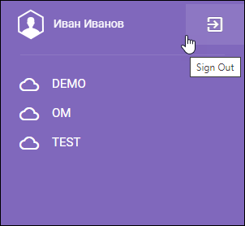

# Авторизация

!!! note "Требования к браузеру"
    Для работы в системе необходимы последние версии Webkit браузеров (Google Chrome, Яндекс.Браузер, Opera или Safari). 

## Регистрация

При первом входе в систему пользователю требуется регистрация.
Для регистрации в системе перейдите по ссылке-приглашению, предоставленной администратором.

Для создания регистрационной записи введите **имя** (First Name), **фамилию** (Last Name), задайте и подтвердите пароль в соответствующих полях.

!!! tip "Требования к паролю"
    В системе реализованы следующие требования к паролю: пароль должен быть не короче 8 символов. Содержать буквы от A до Z и от a до z, содержать цифры от 0 to 9, а также специальные символы !@#$%^&*()-+_=[]{}<>,./\?|`~:;

Подтвердите, нажав **Sign In**.

После регистрации откроется профиль пользователя.

## Профиль пользователя

В профиле пользователя в соответствующих блоках отображены основные сведения о пользователе: адрес электронной почты, имя, фамилия, сведения о текущих и завершенных сессиях, а также список доступных рабочих пространств.

### Account Info

В блоке Account Info вы можете исправить **имя** (First Name)  и **фамилию** (Last Name). Поля доступны для редактирования. Для сохранения изменений нажмите значок  справа от соответствующего поля.

### Рабочее пространство

Панель справа отображает список доступных пользователю рабочих пространств. Для перехода в рабочее пространство необходимо выбрать его щелчком мыши. 

### Выход из системы

Для выхода из системы нажмите **Sign Out**:

## Вход в систему

Для входа в систему введите свой адрес электронной почты и пароль в окне **Sign In**:

### Некорректные аутентификационные данные

В случае ввода некорректных логина и\или пароля, система выдаст сообщение об ошибке: *No user found for given credentials*:

Если используется способ входа через **AD** и данные вводятся некорректно, система выдаст ошибку: *Error: Incorrect username or password*.

В случае ввода некорректного пароля более заданного в настройках системы количества раз (по умолчанию **не более 5 попыток**), аккаунт будет **заблокирован на 15 минут**, а система выдаст сообщение: *Too many failed sign in attempts. Please try again in 15 minutes*.

По истечении указанного времени попробуйте еще раз или обратитесь к администратору.

Если вы забыли пароль, воспользуйтесь опцией *Forgot password?* для смены пароля.

## Смена пароля

### Переустановка пароля по запросу пользователя

Для установки нового пароля перейдите по ссылке **Forgot password?** в диалоге входа в систему.

В появившемся диалоге **Reset Password** необходимо указать зарегистрированный в системе адрес электронной почты, на который будет отправлено письмо со ссылкой для сброса пароля.

### Смена пароля по истечении срока его действия

Когда срок действия вашего текущего пароля истечёт, после входа в систему откроется форма для установки нового пароля:

В этой форме вам нужно ввести текущий пароль в поле **Current password**. Затем введите новый пароль в поле **New password** и повторите его в поле **Repeat password**.

Новый пароль должен отличаться от текущего. Если вы введёте новый пароль, который совпадает со старым, система выдаст сообщение об ошибке.

В настройках системы можно установить минимальное количество изменённых символов при смене пароля. Обычно это значение равно 1, но администратор может его увеличить в соответствии с требованиями вашей компании.

После успешной замены пароля система сообщит вам об этом:

Чтобы войти в систему, нужно перейти по ссылке **Sign in with new password**.  

