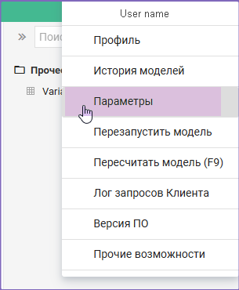
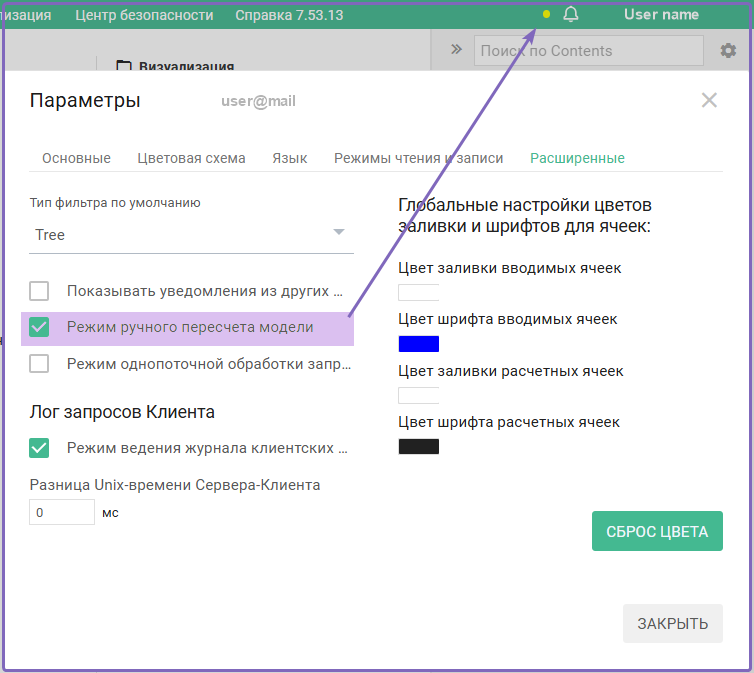
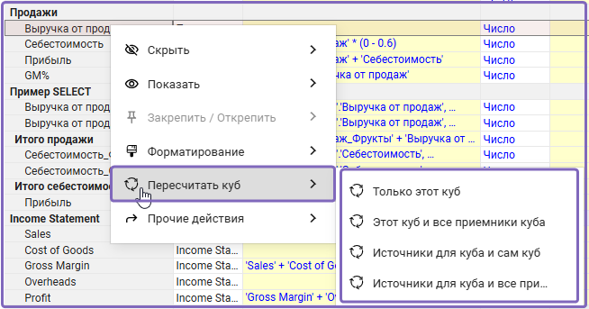
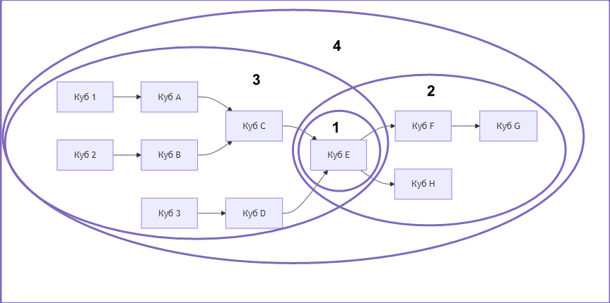

# Режим ручного пересчёта модели

## Включение режима ручного пересчёта модели

В случае работы с большими объемами данных целесообразно использовать **Режим ручного пересчёта кубов модели**. Данный режим обеспечивает пересчёт только определённых моделером кубов по требованию и не затрагивает остальную часть модели.

Порядок включения режима ручного пересчёта:

1. Перейдите в меню под именем пользователя (правый верхний угол системы).
1. Выберите пункт меню **Параметры**.
   
    

1. В открывшемся окне на вкладке **Расширенные** отметьте пункт **Режим ручного пересчёта модели**.

    

1. Данный режим считается включённым, если рядом с именем пользователя появляется фигура точки.

!!! warning "Обратите внимание"
    После этой настройки автоматический пересчет не работает.

## Пересчёта конкретного куба

Чтобы выполнить пересчёт куба, надо выполнить следующее:

1. Встать на ячейку с необходимым кубом.
2. Вызвать контекстное меню правой кнопкой мыши.
3. В открывшемся меню перейти к пункту меню **Пересчитать куб** и выбрать нужный вариант пересчёта:
    * Только этот куб;
    * Этот куб и все приемники куба;
    * Источники для куба и сам куб;
    * Источники для куба и все приемники куба.
   

!!! warning "Обратите внимание"
    В данном режиме при вводе (изменении) расчётной формулы для куба пересчёт происходит только после применения одного из этих четырёх вариантов действий или по кнопке ***F9***, при пересчёте всей модели. 

> ***Термины***
> 
> *Приемники для куба* – это кубы, которые зависят от данного куба, т.е. их значения формируются с использованием значений данного куба.
>
> *Кубы источники для данного куба* – это кубы, на основе значений которых формируются (вычисляются) значения данного куба.

## Принцип ручного режима пересчета (*не готово*)

Рассмотрим принципы работы ручного режима пересчёта кубов на примере.

У вас есть сложная модель с большим объемом данных и разветвленной логикой. Необходимо внести изменения в небольшую часть модели, например, в один из кубов.

Что происходит при изменениях:

* Автопересчёт: Любое изменение в расчётах куба запускает пересчет всех связанных кубов. Нажатие на F9 пересчитает всю модель целиком.
* Минус автопересчёта: При больших данных это может занять много времени, особенно если изменения касаются метаданных — такие изменения часто затрагивают значительное число кубов.
  
Поэтому, для ускорения работы включите режим ручного пересчета. В этом режиме пересчитываются только те кубы, которые вы выбрали.

Рассмотрим несколько кубов, которые являются частью некой модели:

* Куб 1, Куб 2, Куб 3 – это кубы, ячейки которых являются вводимыми.

* Куб A, Куб B, Куб C, Куб D, Куб E, Куб F, Куб G и Куб H – это кубы, ячейки которых являются формульными.

Допустим, нашей целью является провести изменения с *кубом E*.

По схеме видно, что:

* Источники для куба Е:
    * Куб 1, 
    * Куб 2, 
    * Куб 3, 
    * Куб A, 
    * Куб B, 
    * Куб C, 
    * Куб D.
* Приемники куба Е: 
    * Куб F, 
    * Куб G, 
    * Куб H.

Описание вариантов расчёта ниже в таблице.

| **Вариант расчёта** | **Процесс расчёта** | **Результат** |
|:--------------|:--------------|:------------|
| Только этот куб     | Пересчитываются значения ячеек только данного куба E. Это может быть удобно, например, если известно, что кубы источники уже содержат актуальную информацию. Или если актуальность информации сейчас не важна, но важно посмотреть как при конкретных настройках куба E, данные из кубов источников отобразятся в нем    |  Обеспечивает расчёт только интересующего нас куба и может применяться для проверки логической корректности введенной формулы  |
| Этот куб и все приемники куба    | Пересчитываются значения ячеек для кубов: E, F, G и H, это может быть полезно, чтобы посмотреть, как внесенные изменения в куб E повлияли на последующие расчёты.    |  Гарантирует актуальность конечных результатов, начиная с интересующего нас куба |
| Источники для куба и сам куб     | Пересчитываются значения ячеек для кубов: 1, 2, 3, A, B, C, D, E. По факту этот запрос актуализирует данные куба E     |  Гарантирует актуальность расчёта от вводимых данных до интересующего нас куба  |
| Источники для куба и все приемники      | Пересчитываются значения ячеек для кубов: 1, 2, 3, A, B, C, D, E, F, G и H      |   Гарантирует актуальность всех данных, связанных с интересующим нас кубом в плоть до вводимых данных  |

Графическое изображение расчёта ниже.

