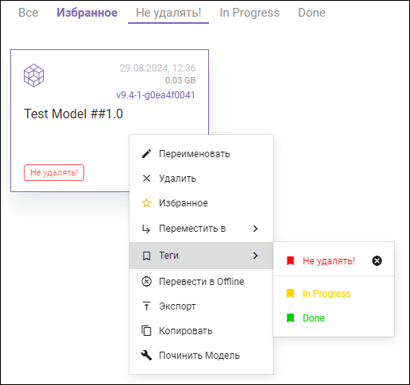

{#model-control}
# Управление моделями

## Отображение моделей
{#model-control-view}

После входа в систему вы попадаете в **Рабочее пространство**. Здесь вы увидите доступные для работы модели в виде карточек или списка. Модели размещены на закладках, соответствующих тегам моделей. и могут находиться внутри папок.

Кнопки  и  переключают отображение моделей c карточек на список и обратно.

В правом верхнем углу каждой карточки модели отображается информация о времени последнего посещения модели, объём требуемой памяти и версия Optimacros.

Модели, которые в данный момент недоступны для работы и находятся в режиме **Offline**, помечены статусом **недоступна** и выделены бледным цветом.

Строка поиска служит фильтром по названию отображаемых моделей. Чтобы найти нужную папку или модель, начните вводить в строку поиска её название. Чтобы показать все модели, очистите строку поиска.

В правой части окна расположена панель, на которой отображаются следующие элементы:

- **Имя пользователя**. Нажав на него, вы можете перейти к настройкам профиля, посмотреть версию программного обеспечения, историю переключения между моделями, или выйти из рабочего пространства, чтобы вернуться на страницу авторизации.
- **График**, отображающий объём оперативной памяти и занимаемое моделями пространство относительно выделенного рабочего пространства.
- **Список доступных рабочих пространств**. Вы можете перейти в нужное рабочее пространство, нажав на его название.

## Действия с моделью

Нажмите правой кнопкой мыши на карточке модели для вызова меню:

Доступны следующие действия:

### Переименовать

Позволяет изменить имя модели. При вводе текста осуществляется проверка на уникальность имени.

### Удалить

Удаление модели - необратимый процесс, поэтому он требует дополнительного подтверждения:

### Избранное

Добавить модель в **Избранное**. 

Модели, добавленные в **Избранное**, отмечены звездочкой и отображаются на соответствующей вкладке **Избранное**:

### Переместить

Позволяет переместить модель в созданную ранее папку. 

Информация о том, как создать папку, представлена в разделе [Папки][model-control-folders].

### Теги

Позволяет отметить модель тегами или, при повторном выборе, снять отметку. Модели, отмеченные тегами, отображаются на соответствующих вкладках:

Теги (метки) позволяют структурировать модели в рабочем пространстве и облегчают их поиск. Виды тегов определяет администратор.

### Перевести в Offline / Перевести в Online

Переключает состояние модели **Online/Offline**. Модель в состоянии **Offline** имеет статус `недоступна` и выделена серым цветом фона:

### Экспорт

Создаёт ZIP-архив модели и отправляет его в браузер для загрузки. Параметры загрузки файла зависят от настроек вашего браузера.

Файл архива модели — это ZIP-архив, который содержит дамп базы данных модели и конфигурационную информацию. Его можно будет импортировать в рабочее пространство для создания модели.

#### Импорт модели из файла

Вы можете импортировать файл архива модели, который находится в локальной папке, в рабочее пространство, просто перетащив его на окно браузера. При этом внешний вид рабочего пространства изменится, так как будет создана зона загрузки файлов:

После перетаскивания появится диалог с запросом подтверждения:

При утвердительном ответе начинается загрузка архива на сервер:

После загрузки архива модель создается на сервере и становится доступной пользователям, то есть переводится в онлайн-режим:

Созданной в результате импорта модели будет автоматически присвоено уникальное имя.

!!! note "Требования к версиям"
    Нельзя импортировать модель, созданную в рабочем пространстве определенной версии, в рабочее пространство более старой версии. Также нельзя импортировать модели из неофициальных и тестовых выпусков.

### Копировать

Создает копию модели в текущей папке. Уникальное имя присваивается автоматически.

### Починить модель

Запускает полный пересчет модели, что позволяет актуализировать данные и обнаружить ошибки.

## Папки
{#model-control-folders}

Папки помогают организовать модели в рабочем пространстве и упрощают их поиск. Папки имеют древовидную структуру и могут содержать до **двух уровней** вложенности.

Папка верхнего уровня называется корневой и обозначается значком 

На карточке папки в правом верхнем углу отображается число моделей, находящихся в этой и всех вложенных папках:

Чтобы открыть папку, нужно нажать на её карточку. Для возврата на предыдущий уровень используйте навигационные ссылки:

### Создать папку

Чтобы создать папку, нужно щелкнуть правой кнопкой мыши в свободном месте на странице рабочего пространства и выбрать `Создать Папку`:

В появившемся диалоге будет предложено автоматически сформированное уникальное имя. Его можно изменить. При вводе текста осуществляется проверка на уникальность имени.

### Переименовать, переместить, удалить папку

При нажатии правой кнопкой мыши на карточку папки появляется контекстное меню с командами `Переименовать`, `Удалить`, `Переместить в`:

!!! tip "Удаление непустой папки"
    При удалении непустой папки ее содержимое переносится в корневую папку.

## Что дальше?

Изучите раздел  [Измерения][model-dimensions].