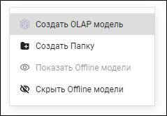
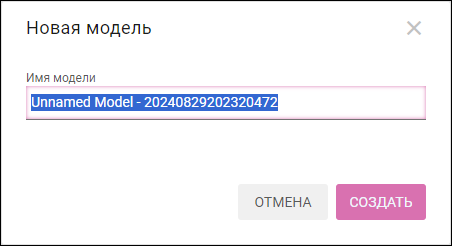
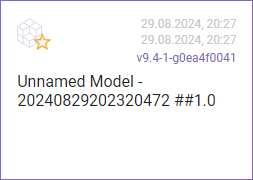
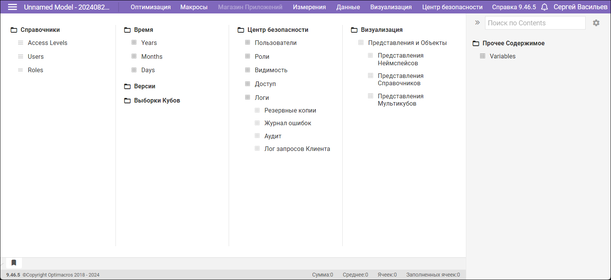

# Создание модели

Чтобы создать новую модель, необходимо щёлкнуть правой кнопкой мыши по свободному месту на странице рабочего пространства и выбрать в меню **Создать OLAP модель**:

Уникальное имя для новой модели генерируется автоматически:

Вы можете изменить его. При вводе текста осуществляется проверка на уникальность имени.

Нажмите **СОЗДАТЬ** для создания новой модели. Карточка только что созданной модели появляется в рабочем пространстве:

Нажмите на карточку для начала работы с моделью.

Открывается рабочее пространство, в котором можно приступать к заполнению данными и настройке модели.

