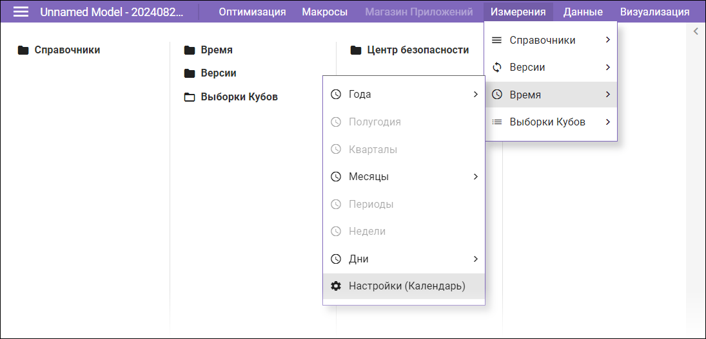
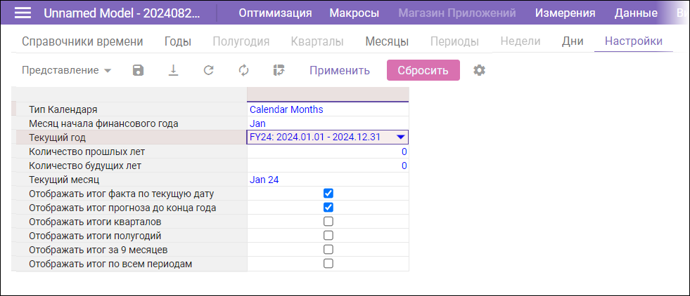
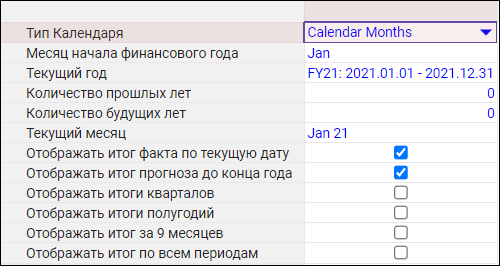
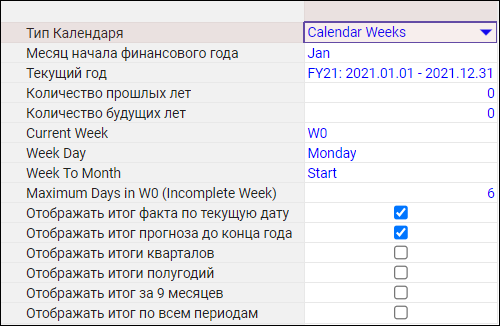
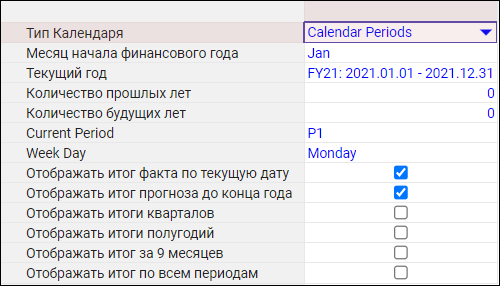
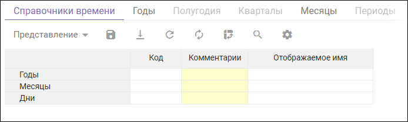

{#model-dimensions}
# Измерения

Измерение – это справочник, в котором объекты сгруппированы по определённой логике и имеют свои атрибуты. Например, в таком справочнике можно найти информацию о компаниях, их филиалах, сотрудниках, продуктах и так далее. Атрибутами продуктов могут быть цена, категория, размер и другие характеристики. 

Процесс заполнения модели данными следует начать с работы над справочниками. Однако перед этим необходимо настроить измерения **Время** и **Версии**, которые уже частично заполнены при создании модели.

## Время

### Настройки календаря

В главном меню рабочего пространства выберите **Измерения -> Время -> Настройки (Календарь)**:

При этом откроется вкладка `Настройки`:

Выберите тип календаря. Это может быть месяц (Calendar Months), неделя (Calendar Weeks), 4-х недельный период (Periods).

### Ограничения возможностей настройки

**Нельзя изменить тип календаря**, если выполняется одно из следующих условий: 

- измерение времени или его выборка используется в мультикубах
- измерение времени или его выборка используется в качестве форматов кубов или свойств элементов справочников 
- элементы измерения времени входят в состав выборки 
- существуют формулы, ссылающиеся на измерение времени или его выборку

!!! note "Конфликты при изменении типа календаря"
    Если измерение **Время** в модели уже настроено, при изменении типа календаря возможны конфликты, потребующие разрешения.

В зависимости от выбранного типа календаря будут доступны для изменения опции, перечисленные ниже.

#### Тип Календаря - Месяцы

Проверьте и задайте при необходимости следующие опции:

| Название | Описание |
| --- | --- |
| **Месяц начала финансового года** | Определить месяц начала финансового года |
| **Текущий год** | Определить текущий год |
| **Количество прошлых лет** | Определить количество прошедших лет, рассчитываемых в модели |
| **Количество будущих лет** | Определить количество будущих лет, рассчитываемых в модели |
| **Текущий месяц** | Определить текущий месяц |
| **Отображать итог факта по текущую дату** | Включать консолидирующий элемент YTD в шкалу времени, равный фактическому периоду, от Месяца начала финансового года до Текущего месяца |
| **Отображать итог прогноза до конца года**| Включать консолидирующий элемент YTG в шкалу времени, равный будущему периоду, от Текущего месяца до месяца, предшествующему Месяцу начала финансового года  |
| **Отображать итоги кварталов** | Отображать консолидирующие элементы по кварталам |
| **Отображать итоги полугодий** | Отображать консолидирующие элементы по полугодиям |
| **Отображать итог за 9 месяцев** | Отображать консолидирующие элементы по 9 месяцам года |
| **Отображать итог по всем периодам** | Отображать консолидирующий элемент по всем периодам, используемым в модели, включая Количество прошлых лет и Количество будущих лет |

Для сохранения изменений нажмите кнопку **Применить**. Для возврата к первоначальныи установкам по умолчанию нажмите **Сбросить**.

#### Тип Календаря - Недели

Проверьте и задайте при необходимости следующие опции:

| Название | Описание |
| --- | --- |
| **Месяц начала финансового года** | Определить месяц начала финансового года |
| **Текущий год** | Определить текущий год |
| **Количество прошлых лет** | Определить количество прошедших лет, рассчитываемых в модели |
| **Количество будущих лет** | Определить количество будущих лет, рассчитываемых в модели |
| **Current Week** | Определить текущую неделю |
| **Week Day** | Определить день, с которого начинается неделя |
| **Week To Month** | Определяет правило включения недели в месяц. Переходящая неделя — это неделя, включающая дни из двух месяцев (например, 5-я неделя с 29 января по 4 февраля). Такая неделя включается в тот или иной месяц на основе одного из следующих правил: **Start** — с какого месяца неделя началась, к тому месяцу и принадлежит (например, 5-я неделя относится к январю). **Most** — в каком месяце дней в этой неделе больше, к тому месяцу и принадлежит (например, 5-я неделя относится к февралю, так как в ней 4 дня, а в январе — 3). **End** — на каком месяце неделя закончилась, к тому месяцу и принадлежит (например, 5-я неделя относится к февралю). |
| **Maximun Days in W0 (Incomplete Week)** | Максимальное количество дней в первой неполной неделе года может принимать значения от 0 до 7. 0 — в любом году первая неделя будет иметь индекс 1, то есть нулевая неделя отсутствует, поскольку в первой неделе любого года будет 1 и более дней. 7 — любая первая неделя года, в которой меньше или равно 7 дней, будет нулевой. Соответственно, все годы будут иметь нулевую неделю, так как нет первой недели, в которой было бы 8 дней и более. Если количество дней в первой неделе меньше или равно указанному в Maximum Days in W0 числу, то неделя считается нулевой (W0). Если количество дней в первой неделе больше, чем указано в Maximum Days in W0, то неделя считается первой (W1). Таким образом, если требуется рассчитать неполную неделю как первую, необходимо указать в Maximum Days in W0 значение, меньшее, чем количество дней в данной неполной неделе. |
| **Отображать итог факта по текущую дату** | Включать консолидирующий элемент YTD в шкалу времени, равный фактическому периоду, от Месяца начала финансового года до Текущего месяца |
| **Отображать итог прогноза до конца года**| Включать консолидирующий элемент YTG в шкалу времени, равный будущему периоду, от Текущего месяца до месяца, предшествующему Месяцу начала финансового года  |
| **Отображать итоги кварталов** | Отображать консолидирующие элементы по кварталам |
| **Отображать итоги полугодий** | Отображать консолидирующие элементы по полугодиям |
| **Отображать итог за 9 месяцев** | Отображать консолидирующие элементы по 9 месяцам года |
| **Отображать итог по всем периодам** | Отображать консолидирующий элемент по всем периодам, используемым в модели, включая Количество прошлых лет и Количество будущих лет |

Для сохранения изменений нажмите кнопку **Применить**. Для возврата к первоначальныи установкам по умолчанию нажмите **Сбросить**.

#### Тип Календаря - Периоды

Проверьте и задайте при необходимости следующие опции:

| Название | Описание |
| --- | --- |
| **Месяц начала финансового года** | Определить месяц начала финансового года |
| **Текущий год** | Определить текущий год |
| **Количество прошлых лет** | Определить количество прошедших лет, рассчитываемых в модели |
| **Количество будущих лет** | Определить количество будущих лет, рассчитываемых в модели |
| **Current Period** | Определить текущий период |
| **Week Day** | Определить день, с которого начинается неделя |
| **Отображать итог факта по текущую дату** | Включать консолидирующий элемент YTD в шкалу времени, равный фактическому периоду, от Месяца начала финансового года до Текущего месяца |
| **Отображать итог прогноза до конца года**| Включать консолидирующий элемент YTG в шкалу времени, равный будущему периоду, от Текущего месяца до месяца, предшествующему Месяцу начала финансового года  |
| **Отображать итоги кварталов** | Отображать консолидирующие элементы по кварталам |
| **Отображать итоги полугодий** | Отображать консолидирующие элементы по полугодиям |
| **Отображать итог за 9 месяцев** | Отображать консолидирующие элементы по 9 месяцам года |
| **Отображать итог по всем периодам** | Отображать консолидирующий элемент по всем периодам, используемым в модели, включая Количество прошлых лет и Количество будущих лет |

Для сохранения изменений нажмите кнопку **Применить**. Для возврата к первоначальныи установкам по умолчанию нажмите **Сбросить**.

### Справочники времени

В справочнике времени представлены элементы, используемые в модели, такие как годы, месяцы, дни и кварталы. Каждому элементу справочника времени может быть присвоен уникальный идентификатор, который используется для синхронизации и интеграции между моделями.

### Представления временных интервалов (лет, месяцев, дней)

Набор доступных представлений временных интервалов определяется настройками календаря (в частности, Текущий Год, Количество прошлых лет, Количество будущих лет). Используйте меню `Измерения -> Время` для выбора нужного интервала и просмотра списка доступных представлений и задания некоторых их характеристик.

### Свойства временных интервалов

## Что дальше?